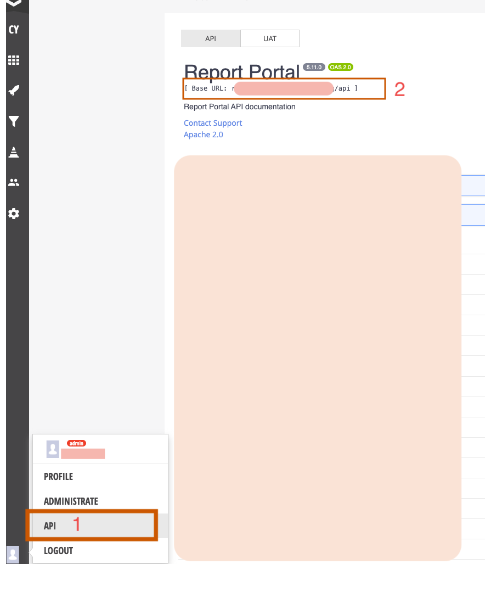
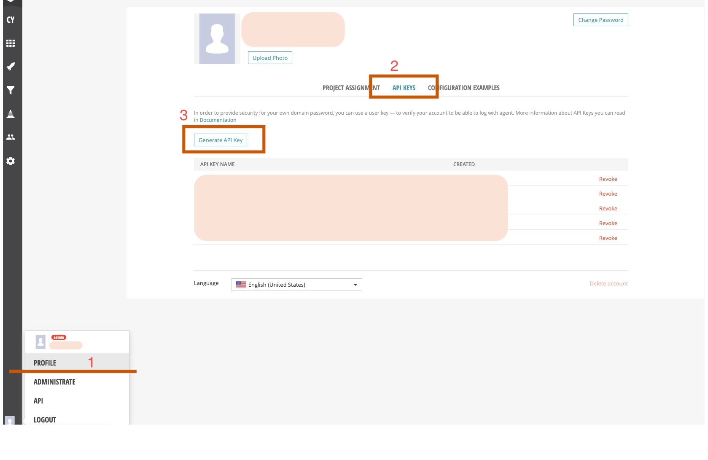

# Report Portal MCP Server

Model Context Protocol (MCP) server for ReportPortal integration.

## Prerequisites

- Node.js (v18 or higher)
- yarn package manager
- ReportPortal instance (URL and API token)
- VS Code (for MCP integration)

## Local Development Setup

### 1. Clone the Repository

```bash
git clone <repository-url>
cd rp-mcp-server
```

### 2. Install Dependencies

```bash
yarn install
```

### 3. Configure Environment Variables

Create a `.env` file in the root directory:

```env
PORT=3003 # (or another you need)
RP_API_URL=<report-portal-base-api>/v1
RP_API_TOKEN=<your-api-token>
RP_CYPRESS_PROJECT_NAME=project-name # (e.g. cypress-nightly)
```

#### How to get Report Portal URL:

1. Log in to your Report Portal
2. Click on the user's avatar in the bottom left corner
3. Select "API" from the dropdown menu
4. Copy the base URL (e.g., `https://reportportal.example.com`)
5. Add `/v1` to the end of the URL (or another version if needed)
6. Example: `https://reportportal.example.com/api/v1`



#### How to get ReportPortal API Token:

1. Log in to Report Portal
2. Click on the user's avatar in the bottom left corner
3. Select "PROFILE" from the dropdown menu
4. In the profile page, find the "API KEYS" tab and click on it
5. Generate new API Key
6. Copy the API token (UUID)



### 4. Build the Project

```bash
yarn build
```

### 5. Run the Server Locally

#### Development Mode (with hot reload):
```bash
yarn dev
```

#### Production Mode:
```bash
yarn start
```

This opens an interactive inspector where you can test MCP tools and functions.

## Integration with VS Code

### 1. Install the MCP Extension

Install the "Model Context Protocol" extension in VS Code (if not already installed).

### 2. Add MCP Server (local) to VS Code

Run the following command in CLI to add the MCP server to VS Code:

```bash
code --add-mcp "{\"name\":\"rp-folio-mcp-server\",\"type\":\"http\",\"url\":\"http://localhost:3003/mcp\"}"
```

This will add the server configuration to your `mcp.json` file. Check correctness of the port in the `url`.

### 3. Restart VS Code

After adding the configuration, restart VS Code for the changes to take effect.

### 4. Verify the Connection

1. Open the MCP panel in VS Code
2. Check that `rp-folio-mcp` appears in the list of connected servers
3. You should see the available tools (e.g., `get_launches`, `get_test_items_to_investigate`)

## How to use MCP with AI Agent in VS Code

See [docs](docs/grab_failed_tests.md).

## Available MCP Tools

- **get_launches**: Fetch recent launches from ReportPortal
- **get_test_items_to_investigate**: Fetch recent test items marked for investigation

## Project Structure

```
src/
  ├── configs.ts                 # Configuration management
  ├── main.ts                    # Main entry point
  ├── stdio-server.ts            # STDIO server entry point
  ├── mcp/
  │   ├── server.ts             # MCP server setup
  │   └── tools/                # MCP tool implementations
  │       ├── get_launches/
  │       └── get_test_items_to_investigate/
  └── report-portal/
      ├── client.ts             # ReportPortal API client
      ├── types.ts              # TypeScript types
      ├── constants/
      └── services/             # Business logic services
```

## Troubleshooting

### Server not connecting in VS Code
- Verify the absolute path in your VS Code settings
- Make sure you've built the project (`yarn build`)
- Check that the `.env` variables are correctly set
- Restart VS Code after configuration changes

### Authentication errors
- Verify your ReportPortal API token is valid
- Ensure the ReportPortal URL is correct and accessible (should end with `/api/v1`)
- Check that your project name matches exactly

### Build errors
- Delete `node_modules` and `dist` folders
- Run `yarn install` again
- Run `yarn build`

## Development

### Running Tests
```bash
yarn test
```

### Linting
```bash
yarn lint
```

## Run inspector in STDIO mode

```bash
npx @modelcontextprotocol/inspector -- npx tsx src/stdio-server.ts

