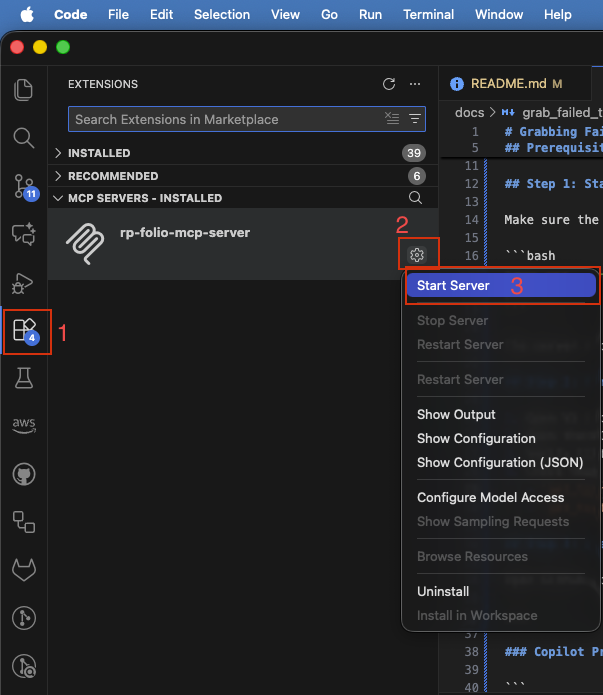
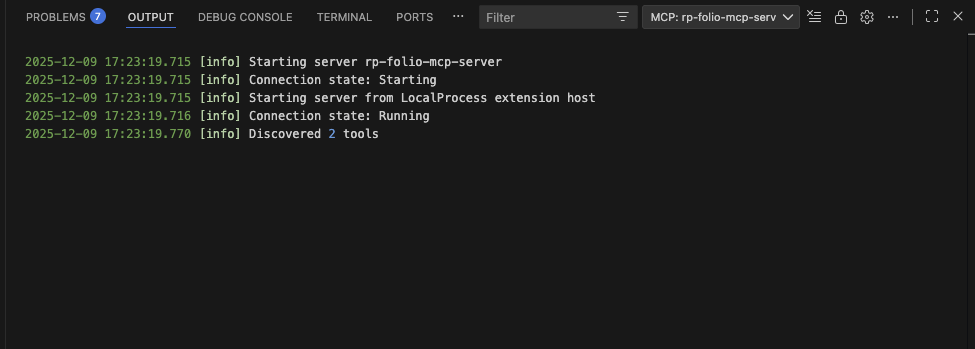
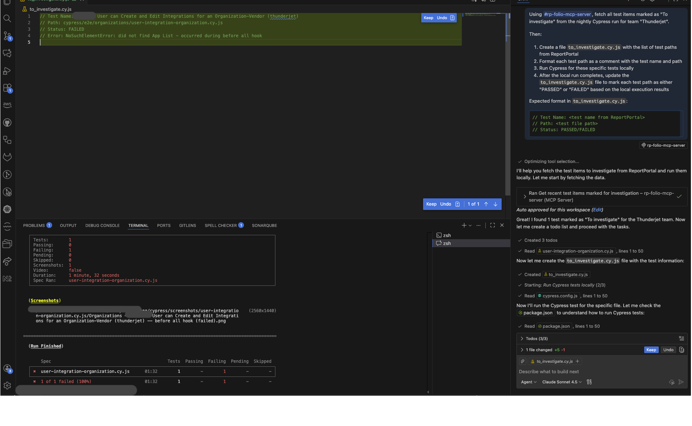

# Grabbing Failed Tests from ReportPortal

This guide shows how to use the MCP server to fetch failed tests from ReportPortal and run them locally with Cypress.

## Prerequisites

1. MCP server is running locally (`yarn dev` or `yarn start`)
2. MCP server is added to VS Code (see main README.md)
3. VS Code with Copilot agent enabled
4. Cypress is installed in your project

## Step 1: Start the MCP Server

Make sure the server is running:

```bash
# From the rp-mcp-server directory
yarn dev
```

The server should be available at `http://localhost:3003/mcp` (or on the port you specified).

## Step 2: Verify MCP Connection in VS Code

1. Open VS Code
2. Open the MCP panel (Extensions -> MCP Servers - Installed) and start MCP server

3. Verify that `rp-folio-mcp-server` is connected and shows state "Running"
4. Check that the available tools are listed:
   - `get_launches`
   - `get_test_items_to_investigate`



## Step 3: Use Copilot Agent to Fetch and Run Failed Tests

Open GitHub Copilot Chat in VS Code and use the following prompt:

---

### Copilot Prompt:

```
Using #rp-folio-mcp-server, fetch all test items marked as "To investigate" from the nightly Cypress run for team "Thunderjet".

Then:
1. Create a file `to_investigate.cy.js` with the list of test paths from ReportPortal
2. Format each test path as a comment with the test name and path
3. Run Cypress for these specific tests locally
4. After the local run completes, update the `to_investigate.cy.js` file to mark each test path as either "PASSED" or "FAILED" based on the local execution results

Expected format in `to_investigate.cy.js`:
```js
// Test Name: <test name from ReportPortal>
// Path: <test file path>
// Status: PASSED/FAILED
```



## Available Teams

You can use this workflow for different teams by changing the `team` parameter:
- `Thunderjet`
- `Spitfire`
- `Firebird`
- `Corsair`
- `Folijet`
- `Vega`
- `Volaris`

## Troubleshooting

### MCP Server Not Connected
- Verify the server is running: `lsof -i :3003`
- Restart VS Code

### No Tests Returned
- Verify the team name is correct (case-sensitive)
- Check that there are tests marked "To investigate" in ReportPortal
- Verify your `.env` configuration (API URL, token, project name)

### Cypress Fails to Run
- Make sure Cypress is installed in your project
- Verify the test paths exist in your project
- Check that you're running the command from the correct directory
